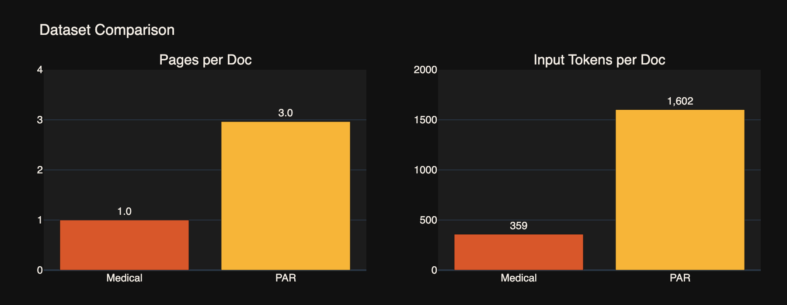
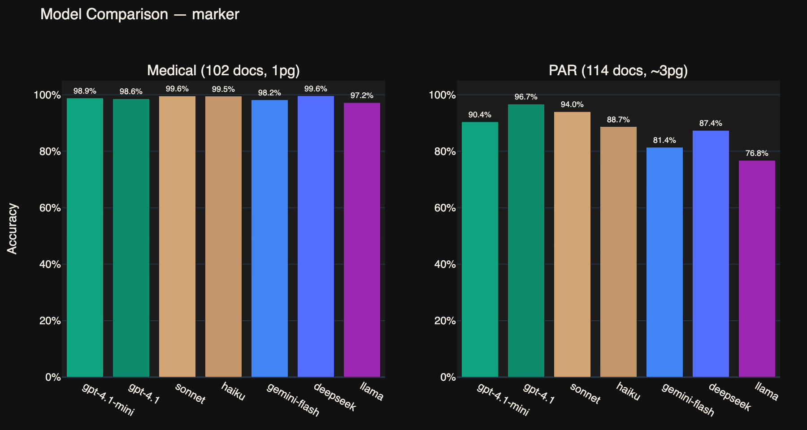
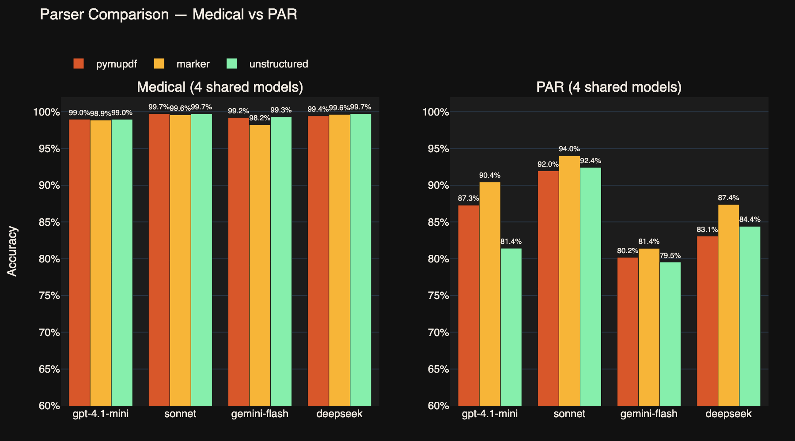
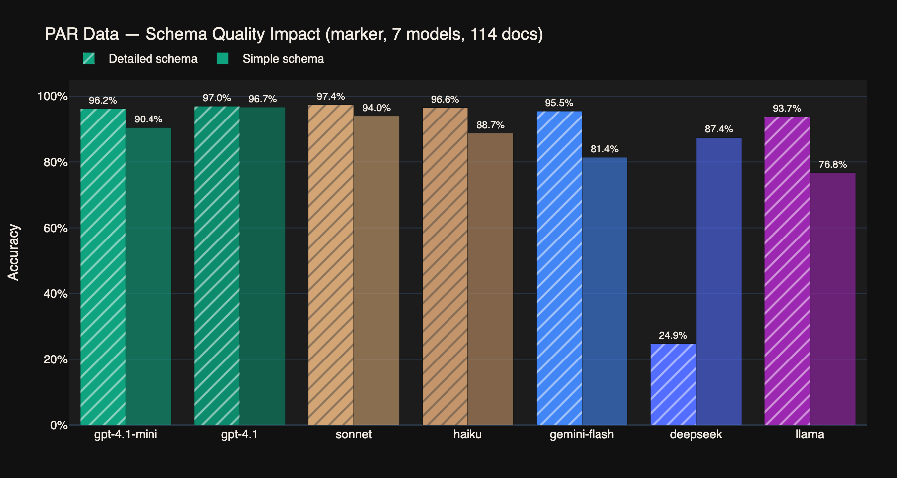
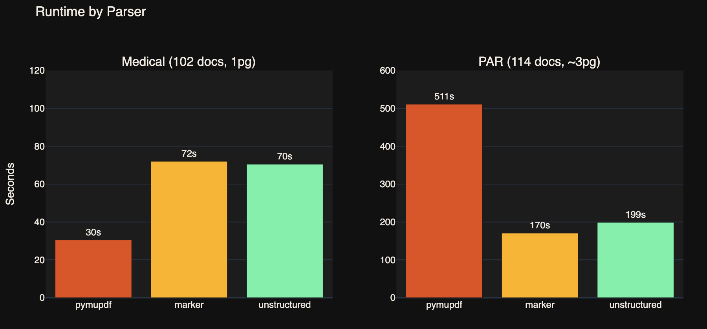
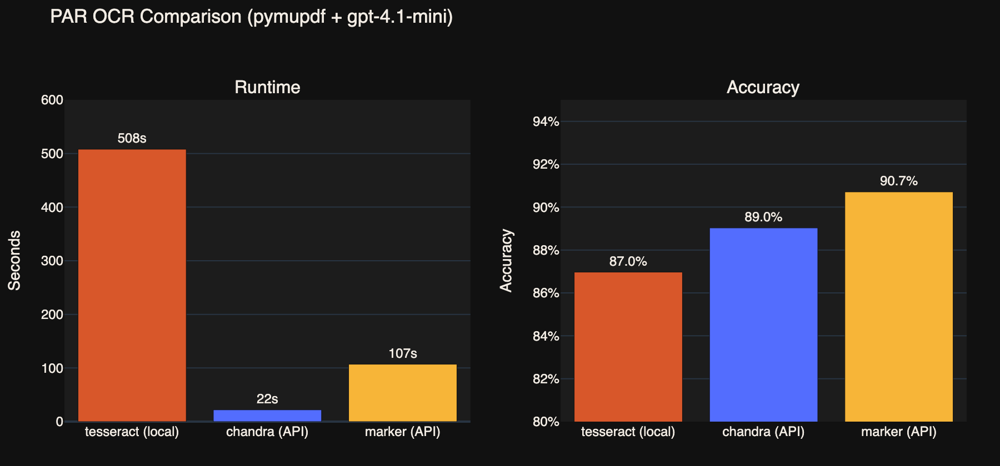
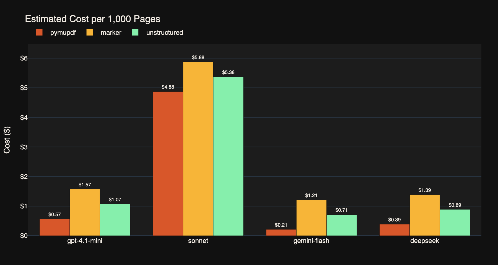
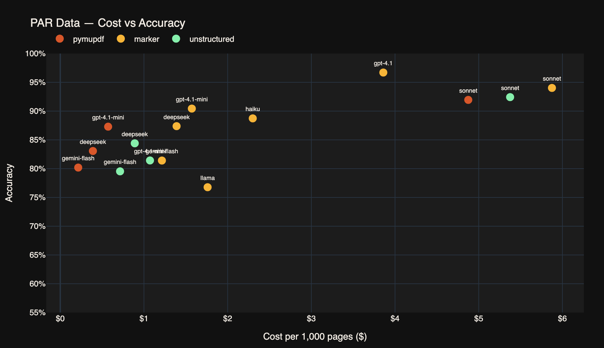

# What We Learned From Petey

Petey presents a good opportunity to compare and contrast the performance of various parsers, LLMs, and combinations of the two.

## Data

For this analysis, we used two data sets:

- **"Medical": 102 artificially generated medical reports**
  Created with Sonnet 4.6 explicitly for the purpose of evaluating PDF extraction performance. Data is a mix of irregular tabular fields and paragraph prose, with instruction to diversify names and genders, and to vary syntax and phrasing.

- **"PAR": 114 New York Housing Court petition responses**
  Real responses to appeals to housing court decisions by TKTK. Scanned documents of varying quality. Some tabular fields, but mostly prose, with some repeated syntax and structure. As an extra challenge, the "issue date" field is stamped, not typed. (Documents with objectively illegible stamps were manually excluded.)

Average page and input tokens per doc for each data set:

"Medical" is the easy task, "PAR" is the challenge.

## Tools

We used TKTK

## Methods

All data extractions were run using in Python using Petey on a MacBookPro with an M1 Pro chip and 16 MB of RAM.

String match scores are the higher of edit distance and cosine similarity.

## Results

### Model Comparison

Documents were parsed with PyMuPDF and Tesseract, then passed to the indicated model.

The PAR documents demonstrate the variation in performance across these models, but the less challenging Medical data shows how less sophisticated models can be a perfectly adequate choice.

### GPT-5 Update

We re-ran the model comparison with OpenAI's GPT-5 family: GPT-5, GPT-5 Mini, GPT-5.4, and GPT-5.4 Mini.

**Medical (easy docs):** GPT-5.4 takes the top spot at 99.8%, narrowly beating the previous best. GPT-5.4 Mini (99.7%) also outperforms every GPT-4 model. On easy documents, the newest models are a clear upgrade — though the margins are thin when everyone is above 98%.

**PAR (hard docs):** The picture is more nuanced. GPT-5 scores 95.0%, slotting in behind GPT-4.1 (96.7%) but ahead of Sonnet (94.0%). GPT-5 Mini matches Sonnet at 94.0% — a significant jump over GPT-4.1 Mini's 90.4%, making it the new value pick for challenging documents.

However, GPT-5.4 and GPT-5.4 Mini struggle on the PAR data (83.9% and 83.7%), particularly on date fields from scanned documents. Despite being the newest models, they perform worse than GPT-4.1 Mini on hard docs. This is a good reminder that newer doesn't always mean better for every task.

| Model | Medical | PAR Simple |
|-------|---------|------------|
| GPT-5.4 | **99.8%** | 83.9% |
| GPT-5.4 Mini | 99.7% | 83.7% |
| GPT-5 | 99.1% | **95.0%** |
| GPT-5 Mini | 98.2% | **94.0%** |
| GPT-4.1 | 98.6% | 96.7% |
| GPT-4.1 Mini | 98.9% | 90.4% |
| Claude Sonnet | 99.6% | 94.0% |

**Bottom line:** GPT-5 Mini is the new default recommendation — it matches Sonnet on hard documents at a fraction of the cost, and handily beats GPT-4.1 Mini. For easy documents, GPT-5.4 Mini is nearly perfect. GPT-4.1 remains the best single model for the hardest tasks.

### Parser Comparison

Similar results using different parser/model combinations. The Medical data shows how you don't need to pay for a parser (Datalab or Unstructured) if your data is pretty easy.

The PAR results are more interesting. Sonnet, Flash and DeepSeek, all three parsers performed pretty similarly. But the difference in accuracy scores when using GPT-4.1-Mini reveal how combining a parser with the wrong model can have a significant impact on performance. Unstructured scores an 81.8%, 5 points lower than PyMuPDF, and 9 points below Datalab.

### Schema Quality

The PAR documents are pretty complicated, and the 100+ tested here are part of a set of a much larger set of over 11,000 documents. In trying to capture the variation across so much data, we had developed a long, sophisticated schema with lots of notes about specific but frequent edge cases. For most of this analysis, we pared that schema down to the bare bones. This is a comparison of the performance of both versions of the PAR schema.

As expected, GPT-4.1 and Sonnet, the "smartest" models of the bunch, get the smallest boost from the more detailed directions, while Haiku and GPT-4.1-Mini see a more significant improvement. Llama jumps a whopping 15 points of accuracy.

Flash is the most interesting, as it performs 6 points worse with the more detailed directions. The schema was too complicated or too long, but it's not immediately clear which. On that note, DeepSeek is absent because the harder schema was too big to even return a response, so there was no data to report.

### Runtime

This is the average time it took for each parser to process each data set across all the models. PyMuPDF is run locally, on CPU, while Datalab and Unstructured are accessed through API calls. For the easy Medical data, the local free parser has the edge. But the PAR data is scanned and needs an OCR to properly parse. Datalab and Unstructured both handle OCR remotely, while PyMuPDF is stuck using the Tesseract OCR locally.

**A note on PyMuPDF's PAR runtime:** PyMuPDF is dramatically slower on PAR because the scanned documents trigger OCR via Tesseract, which runs locally on CPU. To understand the scale of this penalty, we compared OCR backends:

Tesseract needs over 8 minutes to process the average PAR document locally. Datalab's OCR API (Chandra) does it in 22 seconds on their servers. Sending documents directly to Datalab for combined parsing and OCR takes 107 seconds but produces the highest accuracy — only 1.7 points above the standalone OCR, despite taking five times as long.

This is why the PyMuPDF runtime bar is so large for PAR data: it's not the parser that's slow, it's the local OCR. Datalab and Unstructured avoid this entirely by handling OCR on their own servers.

### Cost

Nothing too surprising in this chart of cost per 1000 pages. PyMuPDF is free, so it basically represents the cost of running the LLM. Unstructured and Datalab are both external services, and Datalab is moderately more expensive than Unstructured.

The most notable takeaway here is that Sonnet is roughly five times as expensive as GPT-4.1-Mini, even though it performs only marginally better in our tests. When using Datalab as the parser, paying for the more expensive model only bumps the accuracy up three points, from GPT's 90.7% to Sonnet's 93.8%.

Three percentage points can be a huge jump in some situations, but in others, better parsing can save a lot of money.

This plot makes the point a little more explicitly. The trio of Sonnet points over the $5 mark don't sit much higher than the bulk of the cheaper results, and lower than GPT-4.1.
